::::::::::::::::::::::::::::::::::::::: objectives

- Go through the modify-add-commit cycle for one or more files.
- Explain where information is stored at each stage of that cycle.
- Distinguish between descriptive and non-descriptive commit messages.

::::::::::::::::::::::::::::::::::::::::::::::::::

:::::::::::::::::::::::::::::::::::::::: questions

- How do I record changes in Git?
- How do I check the status of my version control repository?
- How do I record notes about what changes I made and why?

::::::::::::::::::::::::::::::::::::::::::::::::::

Open a **New Session** in JupyterLab Desktop

By default, the session should open in your home directory.
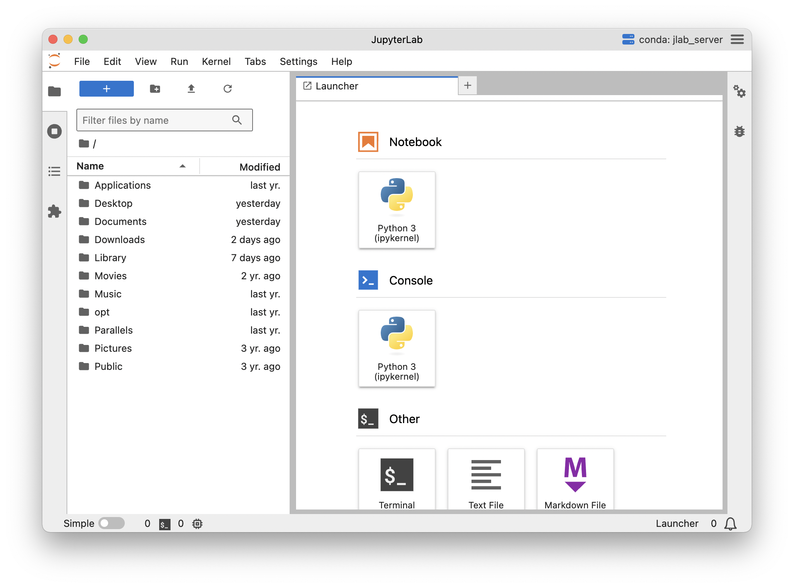
If you do not see the sidebar listing of files and directories, click on the folder icon at the top left. If you do not see a folder icon, click on the gray [hamburger button](https://en.wikipedia.org/wiki/Hamburger_button) at the top right and choose **UI Mode > Multi document IDE**
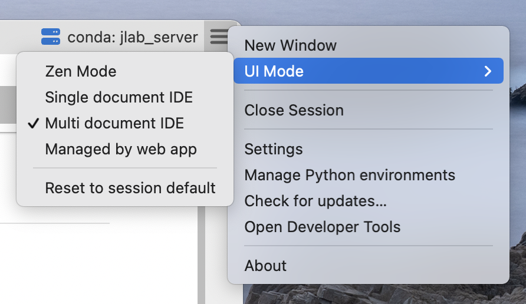


First let's make sure ???

Using the sidebar, navigate to the `Desktop/recipes` directory by double-clicking folders to open them. You should be in the `recipes` directory.
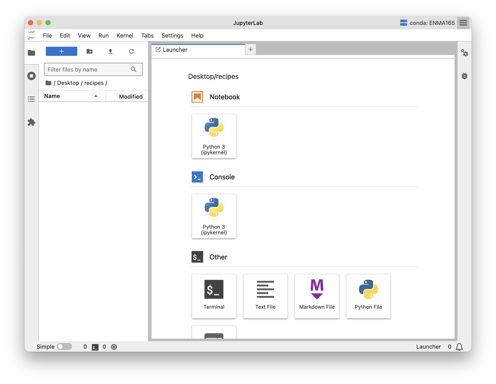
Let's create a file called `guacamole.md` that contains the basic structure of a recipe.
We'll use JupyterLab Desktop to edit the file;
you can use whatever editor you like. 
But remember, the steps to create or edit a new file will depend on the editor you choose (it might not be JupyterLab). For a refresher on text editors, check out ["Which Editor?"](https://swcarpentry.github.io/shell-novice/03-create.html#which-editor) in [The Unix Shell](https://swcarpentry.github.io/shell-novice/) lesson.

In the **Launcher** tab occupying most of the window, click **Other > Markdown File**. The **Launcher** will be replaced by a tab labeled `untitled.md`.
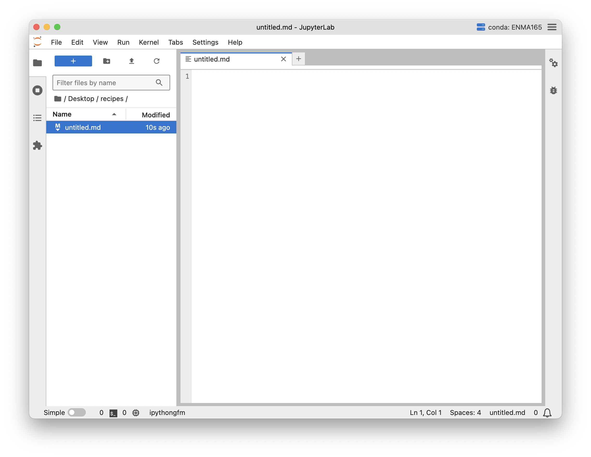
From the toolbar, choose **File > Rename Markdown File** to change the name to `guacamole.md`:
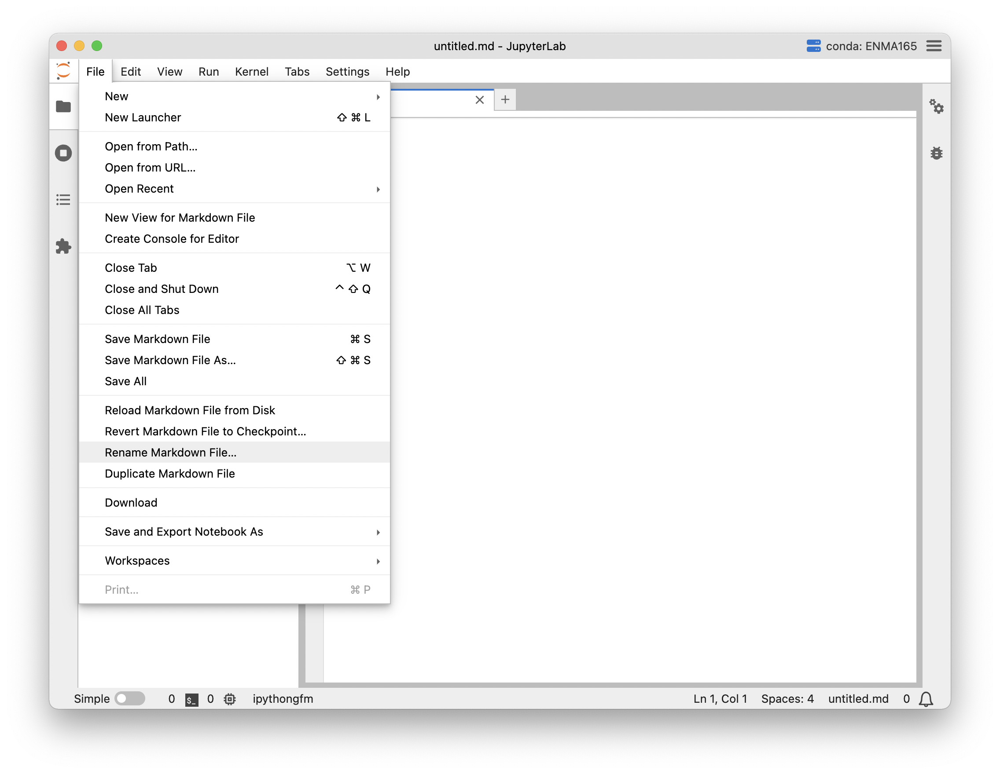
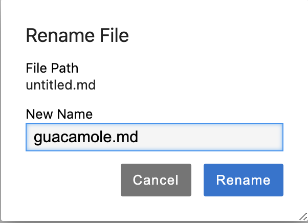

Type the text below into the `guacamole.md` file:

```output
# Guacamole
## Ingredients
## Instructions
```

Save the file.
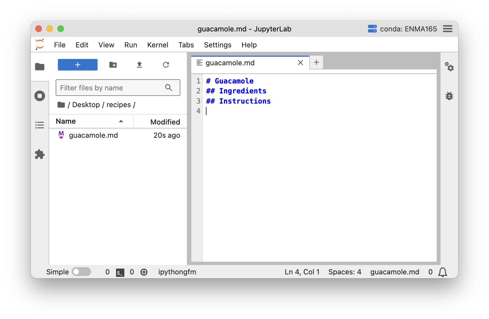
Next, let’s verify that the file was properly created by looking in the file manager:
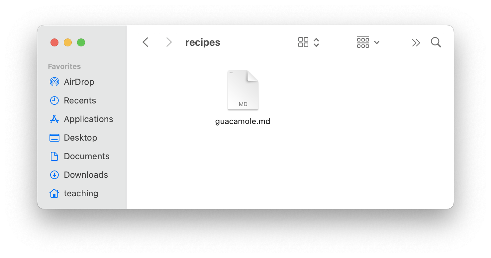
If we check the status of our project in Sourcetree again,
Git tells us that it's noticed the new file:
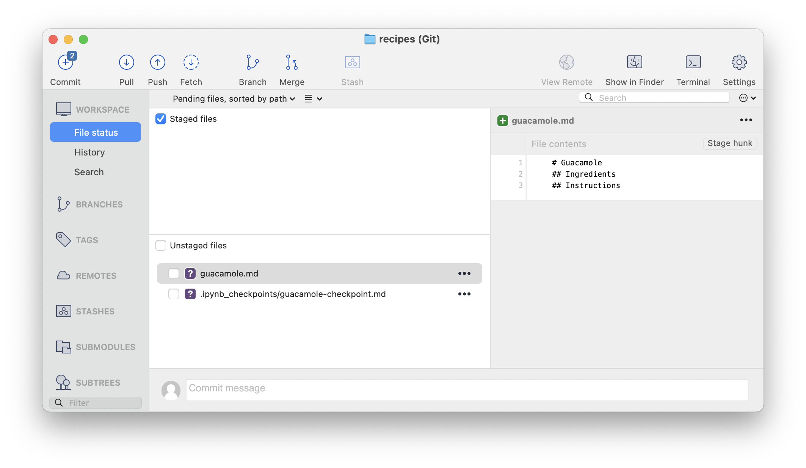

The items with a purple `?` icon next to them in the "Unstaged files" panel means
that there are files in the directory that Git isn't keeping track of
(ignore any items in the `.ipynb_checkpoints` subdirectory for now).
We can tell Git to track a file by 
- clicking the checkbox to the left of the file, or
- clicking the ellipsis (**`...`**) to the right of the file and choosing **Stage file**, or
	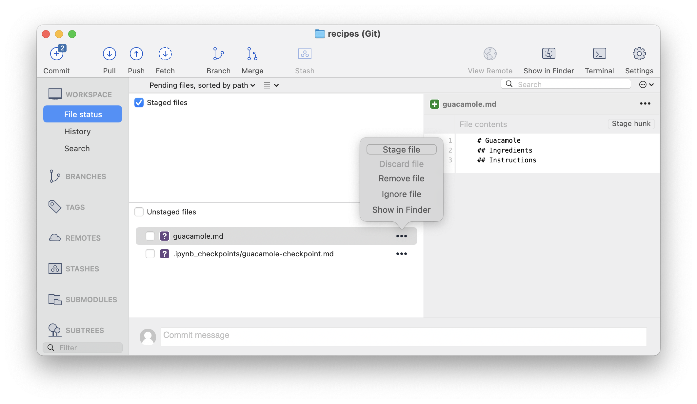
- clicking the plus (**`+`**) button to the right of the file
	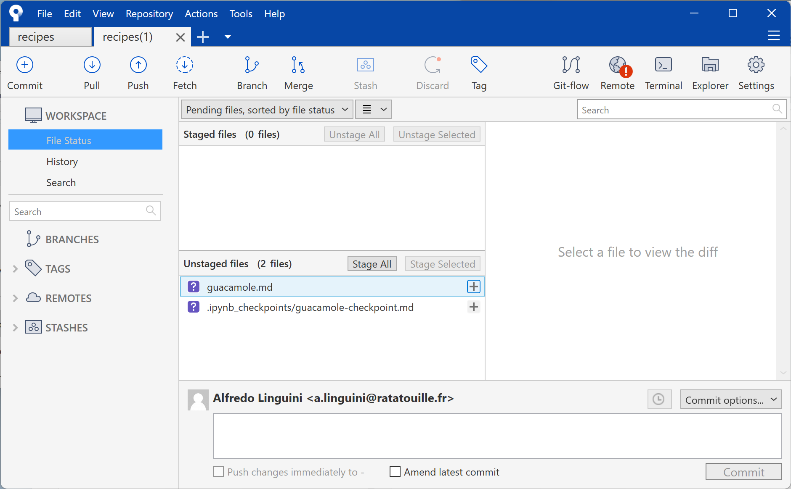

and then check that the right thing happened:
![[Sourcetree_screenshot_staged.png]]
`guacamole.md` has moved to the **Staged files** panel and now has a green `+` icon next to it. Git now knows that it's supposed to keep track of `guacamole.md`,
but it hasn't recorded these changes as a commit yet.
To get it to do that,
we need to do one more step. Click in the box at the bottom that says "Commit message" and enter the text "Create a template for recipe"
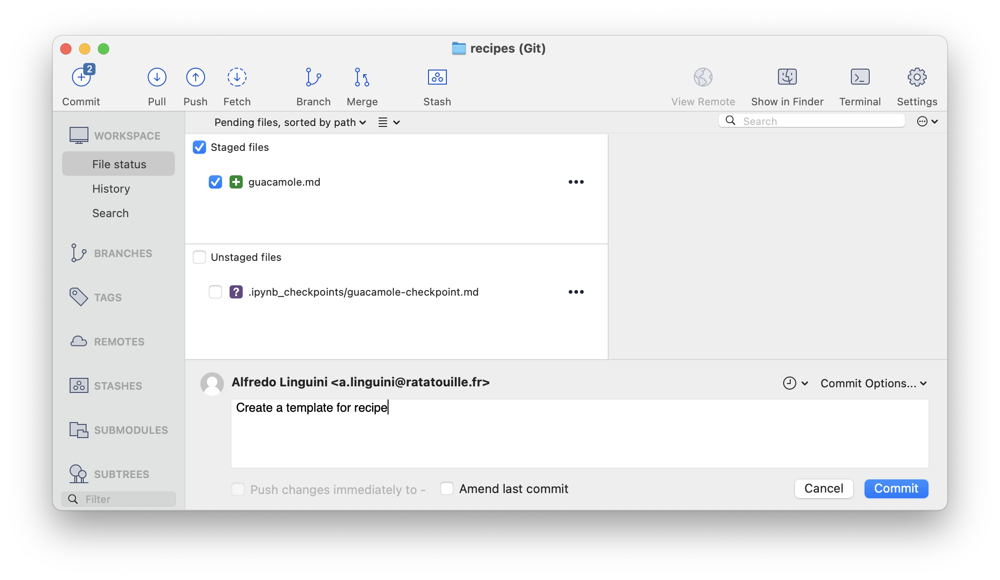

When we click **Commit**,
Git takes everything we have told it to save by putting under **Staged files**
and stores a copy permanently inside the special `.git` directory.
This permanent copy is called a [commit](../learners/reference.md#commit)
(or [revision](../learners/reference.md#revision)) and its short identifier is, e.g., `f22b25e`. Your commit may have another identifier.

We use the commit message
to record a short, descriptive, and specific comment that will help us remember later on what we did and why.

[Good commit messages][commit-messages] start with a brief (\<50 characters) statement about the 
changes made in the commit. Generally, the message should complete the sentence "If applied, this commit will _\<commit message here>_".
If you want to go into more detail, add a blank line between the summary line and your additional notes. Use this additional space to explain why you made changes and/or what their impact will be. 

If we look at the **File status** now

it tells us everything is up to date.
If we want to know what we've done recently,
we can ask Git to show us the project's history selecting **History** in the [Sidebar](https://confluence.atlassian.com/get-started-with-sourcetree/sidebar-847359144.html):
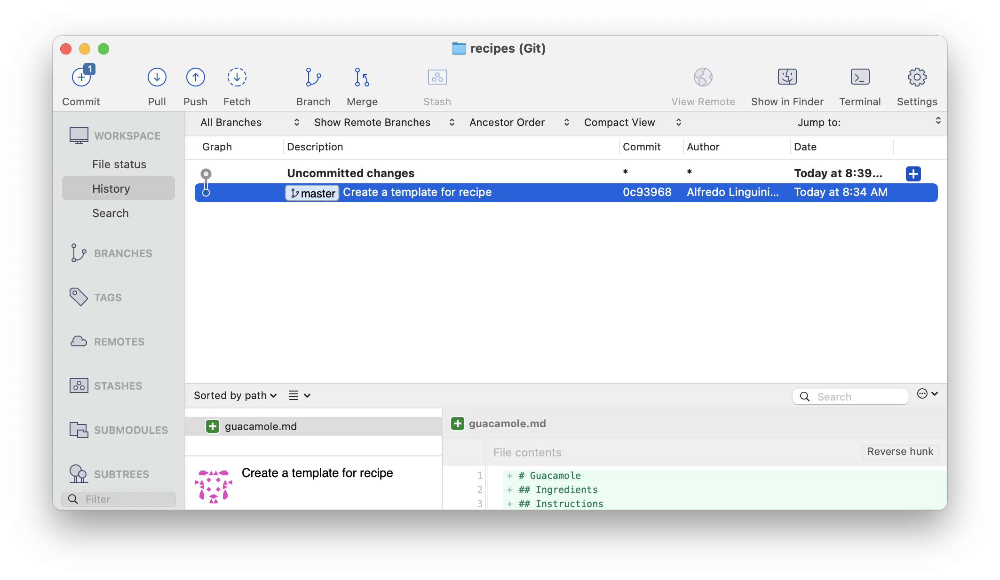
**History** lists all commits  made to a repository in reverse chronological order.
The listing for each commit includes
the commit's full identifier,
the commit's author,
when it was created,
and the log message Git was given when the commit was created.

:::::::::::::::::::::::::::::::::::::::::  callout

## Where Are My Changes?

If we look in the file manager at this point, we will still see just one file called `guacamole.md`.
That's because Git saves information about files' history
in the special `.git` directory mentioned earlier
so that our filesystem doesn't become cluttered
(and so that we can't accidentally edit or delete an old version).


::::::::::::::::::::::::::::::::::::::::::::::::::

Now suppose Alfredo adds more information to the file.

```output
# Guacamole
## Ingredients
* avocado
* lemon
* salt
## Instructions
```

(Again, we'll edit with JupyterLab Desktop;
you may use a different editor.)
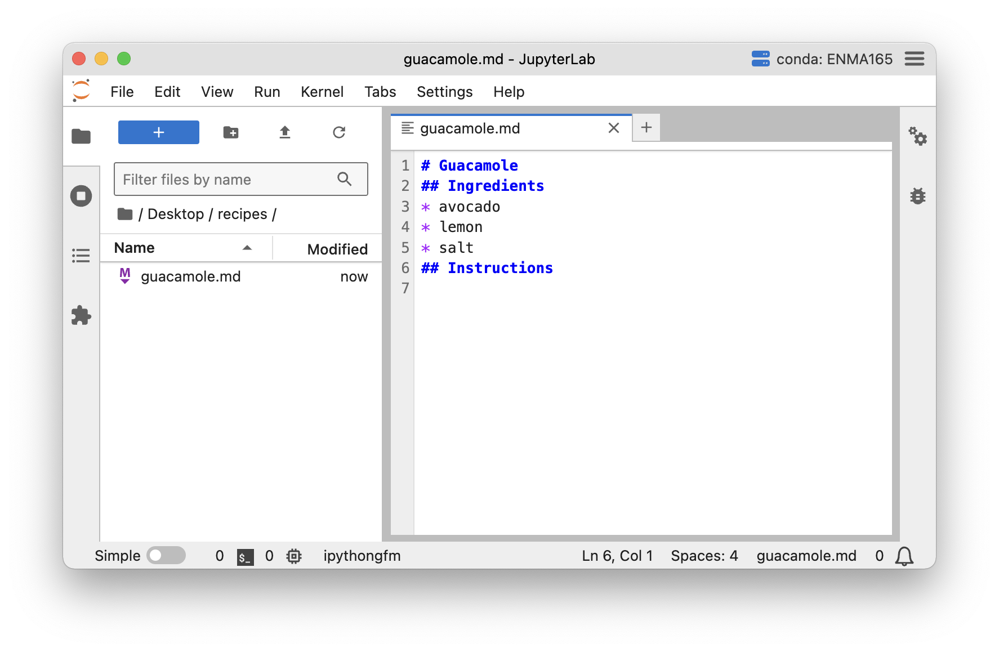
When we look at Sourcetree's **File status** now,
it tells us that a file it already knows about has been modified:
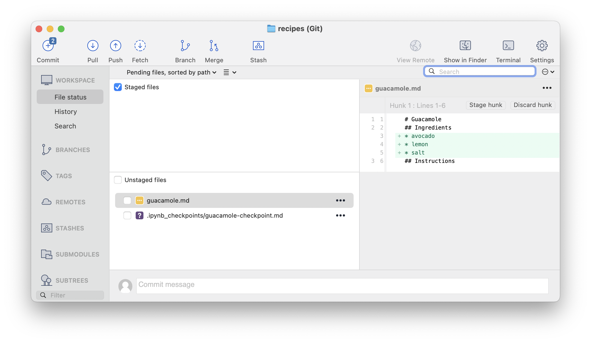
`guacamole.md` now appears in the **Unstaged files** panel with an orange `...` icon.
We have changed this file,
but we haven't told Git we will want to save those changes
(which we do with by clicking the checkbox or selecting **[...] > Stage file**)
nor have we saved them (which we do with **Repository > Commit**).
So let's do that now. It is good practice to always review
our changes before saving them. We do this using the "diff" panel.
This shows us the differences between the current state
of the file and the most recently saved version:

The colored lines are the most interesting, they show us the actual differences
  and the lines on which they occur.
  In particular,
  the `+` marker in the first column shows where we added a line.

After reviewing our change, it's time to commit it. Click on "Commit message" or select **Repository > Commit**, enter the message "Add ingredients for basic guacamole", and click **Commit**.
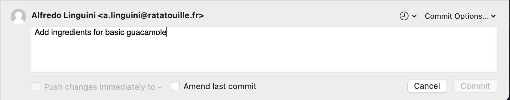

Whoops:
Git won't commit because we didn't use stage first.
Let's fix that; Select `guacamole.md` in the **Unstaged files** panel and select
**Stage file**. Now you should be able to click **Commit**. 

Git insists that we add files to the set we want to commit
before actually committing anything. This allows us to commit our
changes in stages and capture changes in logical portions rather than
only large batches.
For example,
suppose we're adding a few citations to relevant research to our thesis.
We might want to commit those additions,
and the corresponding bibliography entries,
but *not* commit some of our work drafting the conclusion
(which we haven't finished yet).

To allow for this,
Git has a special *staging area*
where it keeps track of things that have been added to
the current [changeset](../learners/reference.md#changeset)
but not yet committed.

:::::::::::::::::::::::::::::::::::::::::  callout

## Staging Area

If you think of Git as taking snapshots of changes over the life of a project, **Stage file** (often called `git add`) specifies *what* will go in a snapshot
(putting things in the staging area),
and **Commit** then *actually takes* the snapshot, and
makes a permanent record of it (as a commit).

If you don't have anything staged when you try to **Commit**, you may be tempted to click **Stage All** or click the checkbox next to **Unstaged files** to stage *all* the changed and untracked files,
which is kind of like gathering *everyone* to take a group photo!
However, it's almost always better to
explicitly add things to the staging area, because you might
commit changes you forgot you made. (Going back to the group photo simile,
you might get an extra with incomplete makeup walking on
the stage for the picture because you selected all!)
Try to stage things manually,
or you might find yourself searching for "git undo commit" more
than you would like!


::::::::::::::::::::::::::::::::::::::::::::::::::

{alt='A diagram showing how "git add" registers changes in the staging area, while "git commit" moves changes from the staging area to the repository'}

Let's watch as our changes to a file move from our editor
to the staging area
and into long-term storage.
First,
we'll improve our recipe by changing 'lemon' to 'lime':
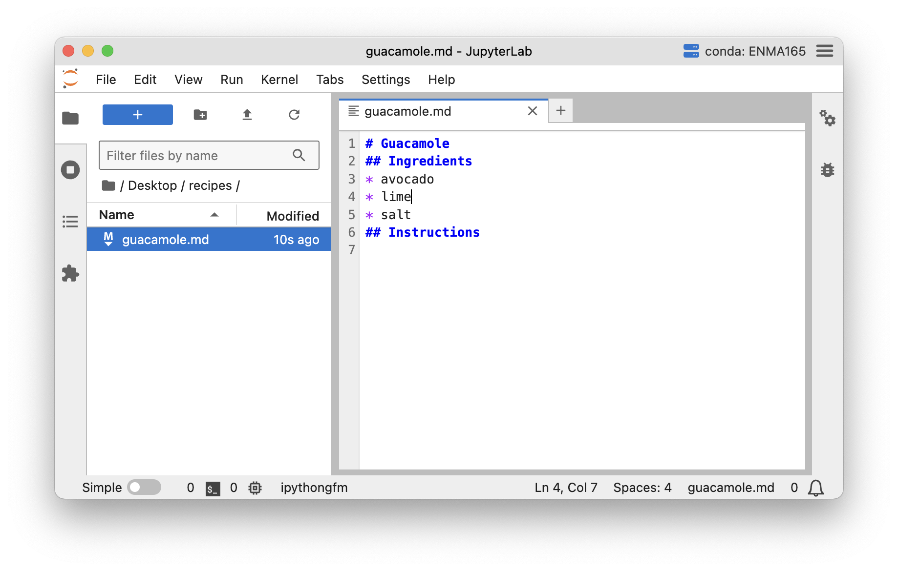
Sourcetree **File status** now shows


So far, so good:
we've replaced one line (shown with a `-` in the first column) with a new line
(shown with a `+` in the first column).
Now let's put that change in the staging area
and see what **File status** shows:

There is nothing in the "diff" panel:
as far as Git can tell,
there's no difference between what it's been asked to save permanently
and what's currently in the directory.
However,
if we select `guacamole.md` in the **Staged files** panel:

it shows us the difference between
the last committed change
and what's in the staging area.
Let's save our changes with the commit message "Modify guacamole to the traditional recipe":

check our status:

and look at the history of what we've done so far:
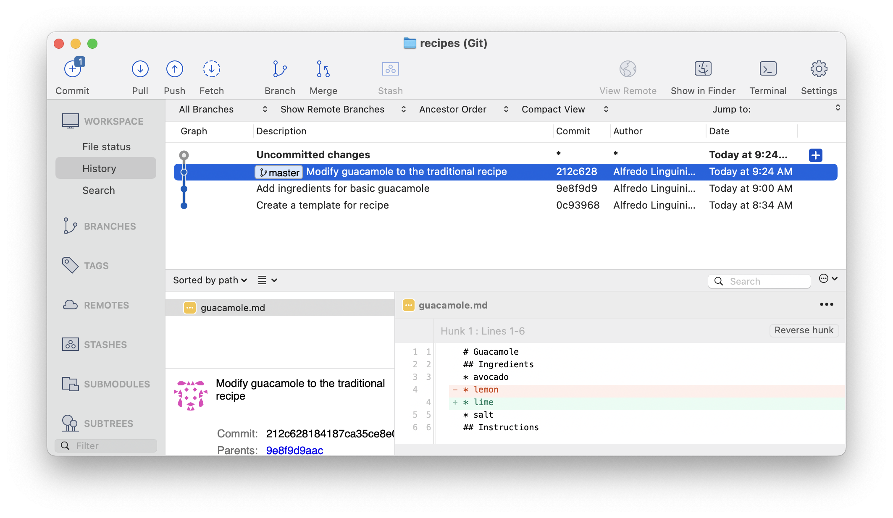
:::::::::::::::::::::::::::::::::::::::::  callout

## Directories

Two important facts you should know about directories in Git.

1. Git does not track directories on their own, only files within them.
  Try it for yourself:
- Use the file manager to create a directory `cakes` within `recipes`:
	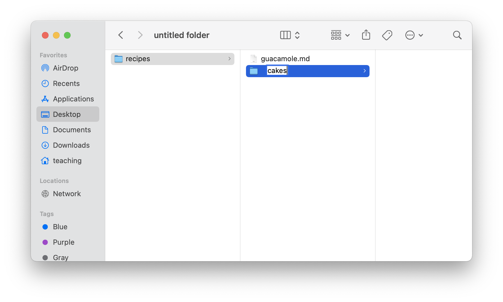
- Examine Sourcetree's **File status**:
	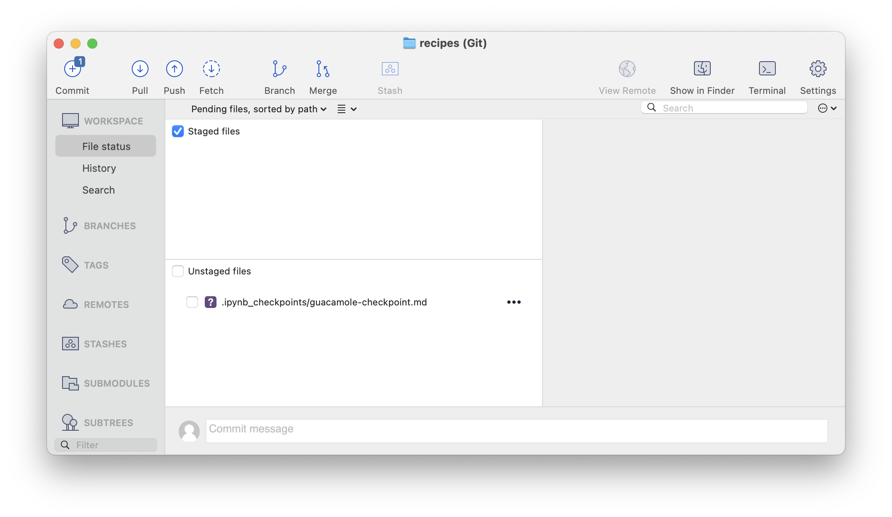

  Note, our newly created empty directory `cakes` does not appear in
  the list of untracked files.
  This is the reason why you will sometimes see `.gitkeep` files
  in otherwise empty directories. The sole purpose of `.gitkeep` files is to populate a directory so that Git adds it to the repository. The name `.gitkeep` is just a convention, and in fact, you can name these files anything you like.

2. If you create a directory in your Git repository and populate it with files,
  you can add all the files in the directory at once by referring to the directory in your `git add` command. Try it for yourself:
	- Using JupyterLab Desktop (or the file manager and your editor of choice), create a directory called `brownie_cakes` within `recipe/cakes`:
	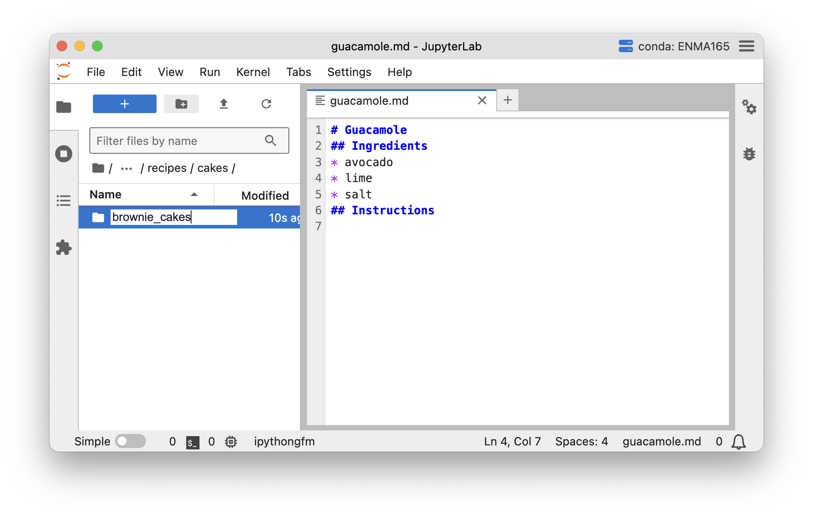
	 and then an empty text file called `lemon_drizzle` within `recipe/cakes/brownie_cakes`:
	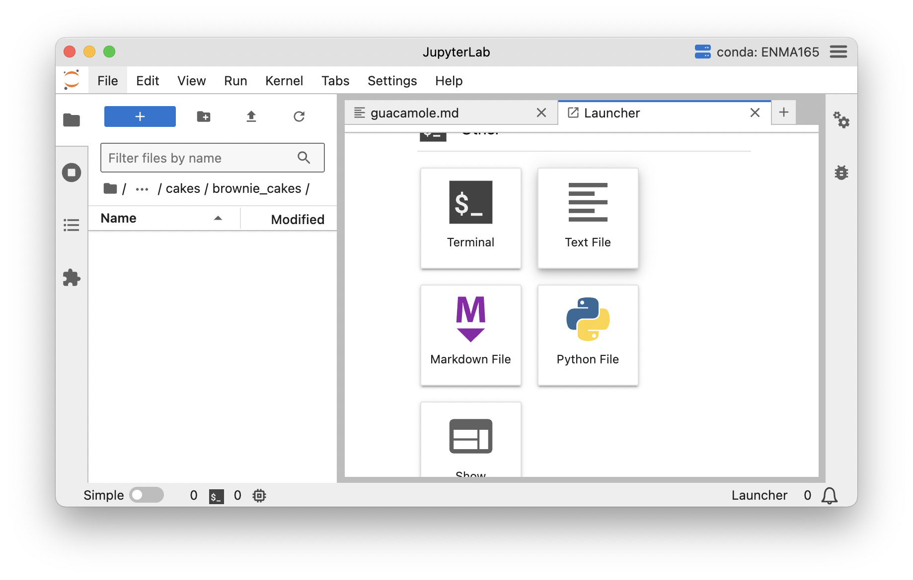	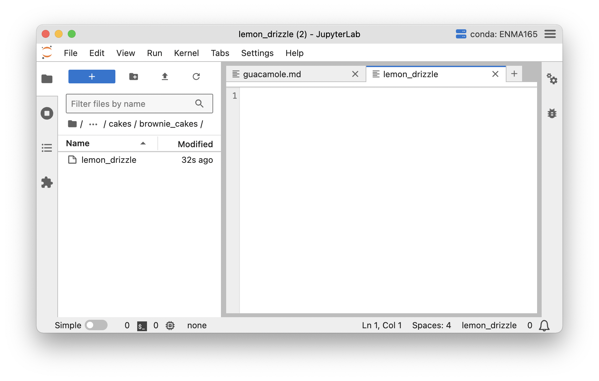
  - Examine Sourcetree's **File status**:
	  
- Click next to `cakes/brownie_cakes/lemon_drizzle` to stage `lemon_drizzle` and all of the directories that contain it.
	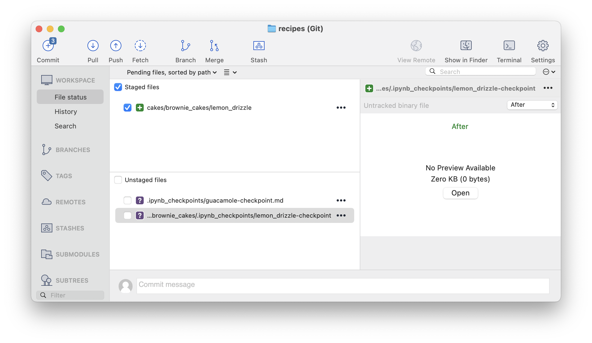
  
  Before moving on, we will commit these changes with the message "Add some initial cakes".
  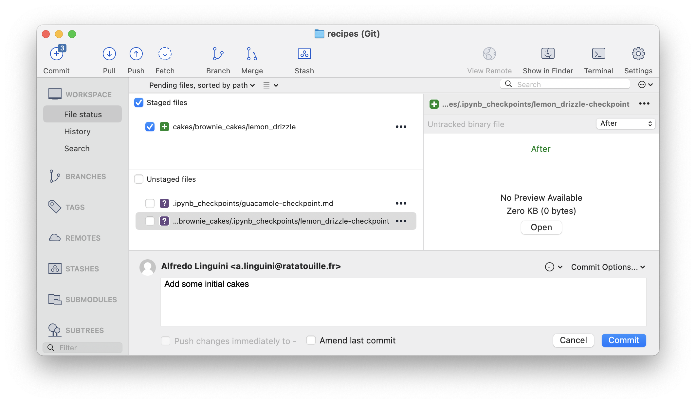

::::::::::::::::::::::::::::::::::::::::::::::::::

To recap, when we want to add changes to our repository,
we first need to add the changed files to the staging area
(**Stage file**) and then commit the staged changes to the
repository (**Repository > Commit**):

{alt='A diagram showing two documents being separately staged using git add, before being combined into one commit using git commit'}

:::::::::::::::::::::::::::::::::::::::  challenge

## Choosing a Commit Message

Which of the following commit messages would be most appropriate for the
last commit made to `guacamole.md`?

1. "Changes"
2. "Changed lemon for lime"
3. "Guacamole modified to the traditional recipe"

:::::::::::::::  solution

## Solution

Answer 1 is not descriptive enough, and the purpose of the commit is unclear;
and answer 2 is redundant to using "git diff" to see what changed in this commit;
but answer 3 is good: short, descriptive, and imperative.


:::::::::::::::::::::::::

::::::::::::::::::::::::::::::::::::::::::::::::::

:::::::::::::::::::::::::::::::::::::::  challenge

## Committing Multiple Files

The staging area can hold changes from any number of files
that you want to commit as a single snapshot.

1. Add some text to `guacamole.md` noting the rough price of the
  ingredients.
2. Create a new file `groceries.md` with a list of products and
  their prices for different markets.
3. Add changes from both files to the staging area,
   and commit those changes.

:::::::::::::::  solution

## Solution

First we make our changes the ingredients in the `guacamole.md` file to:
```output
* avocado (1.35)
* lime (0.64)
* salt (2)
```
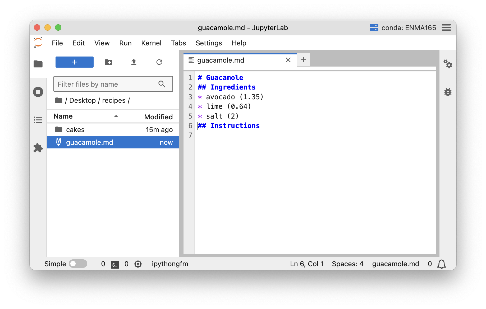
and add a `groceries.md` file containing:
```output
# Market A
* avocado: 1.35 per unit.
* lime: 0.64 per unit
* salt: 2 per kg
```

Now you can add both files to the staging area:
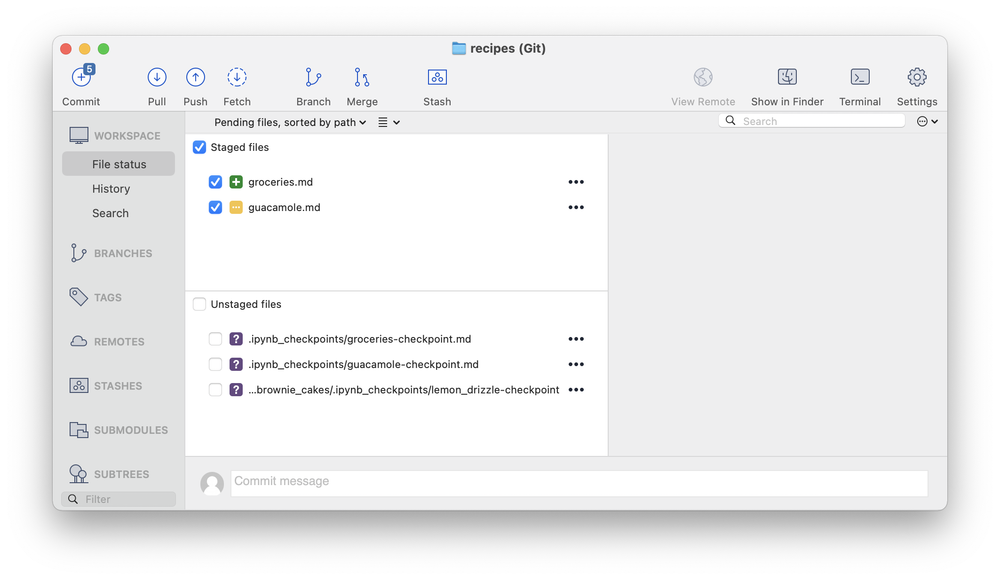

Now the files are ready to commit. If you are ready to commit, use the message "Write prices for ingredients and their source".


:::::::::::::::::::::::::

::::::::::::::::::::::::::::::::::::::::::::::::::

:::::::::::::::::::::::::::::::::::::::  challenge

## `bio` Repository

- Create a new Git repository on your computer called `bio`.
- Write a three-line biography for yourself in a file called `me.txt`,
  commit your changes
- Modify one line, add a fourth line
- Display the differences
  between its updated state and its original state.

:::::::::::::::  solution

## Solution

If needed, move out of the `recipes` folder:
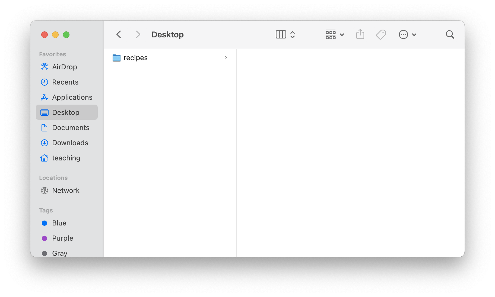

Create a new folder called `bio` and 'move' into it:
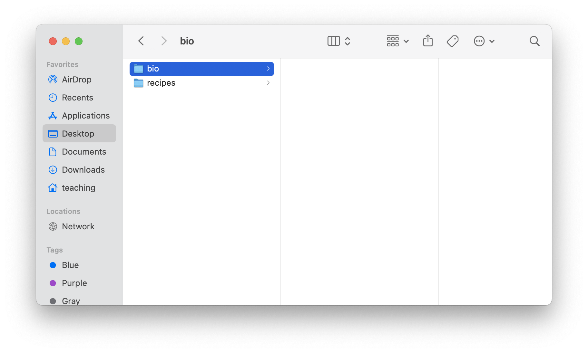

Initialise git with **New > Create Local Repository** (you may need to click the `+` tab to open a new [Bookmarks window](https://confluence.atlassian.com/get-started-with-sourcetree/bookmarks-window-847359137.html) ):


Create your biography file `me.txt` using JupyterLab Desktop or another text editor.
Once in place, add and commit it to the repository:
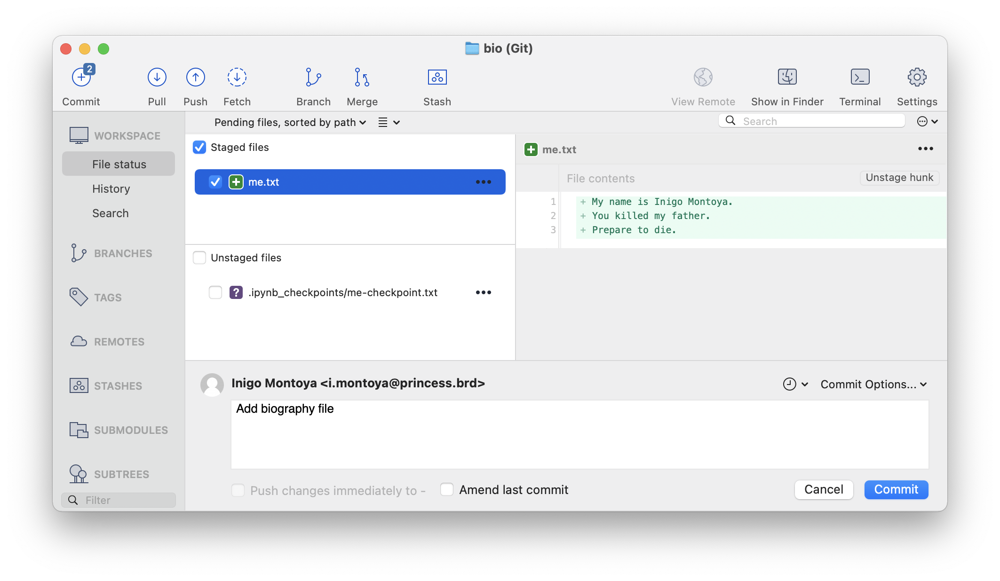

Modify the file as described (modify one line, add a fourth line).
To display the differences
between its updated state and its original state, use "diff" panel:
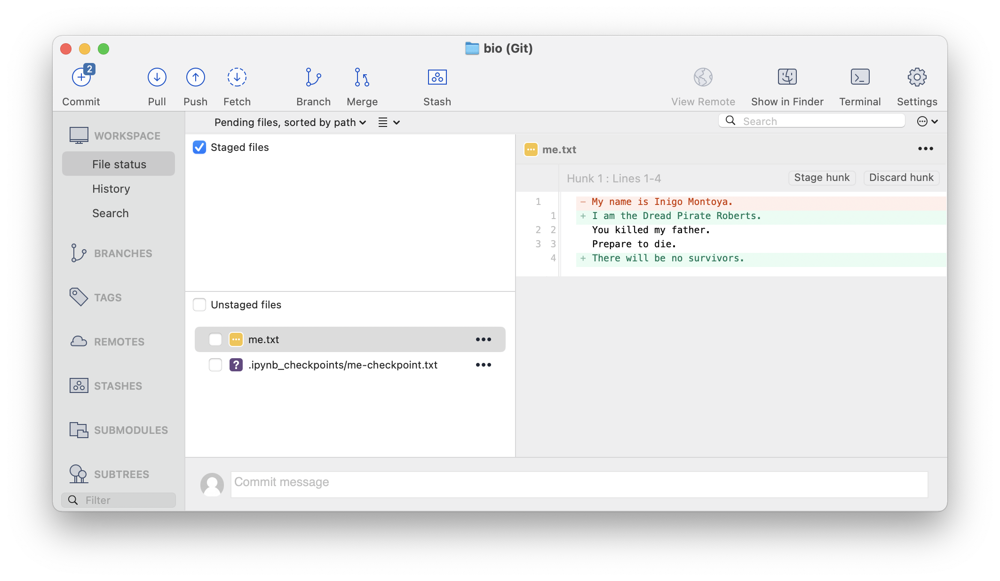
:::::::::::::::::::::::::

::::::::::::::::::::::::::::::::::::::::::::::::::


[commit-messages]: https://chris.beams.io/posts/git-commit/
[git-references]: https://git-scm.com/book/en/v2/Git-Internals-Git-References


:::::::::::::::::::::::::::::::::::::::: keypoints

- **File status** shows the status of a repository.
- Files can be stored in a project's working directory (which users see), the staging area (where the next commit is being built up) and the local repository (where commits are permanently recorded).
- **Stage file** puts files in the staging area.
- **Repository > Commit** saves the staged content as a new commit in the local repository.
- Write a commit message that accurately describes your changes.

::::::::::::::::::::::::::::::::::::::::::::::::::
